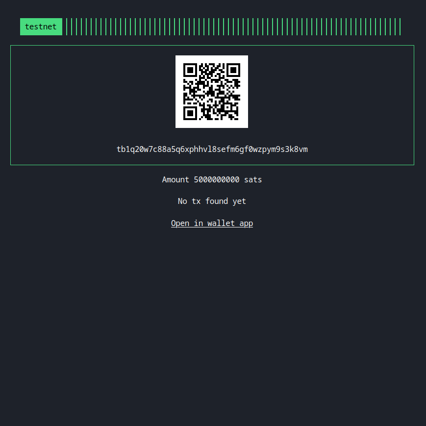

BTCTipServer
===
BTCTip Server is a self-hosted, open-source bitcoin payment processor. 

- :coin: use [bdk](https://github.com/bitcoindevkit/bdk) a modern, lightweight, descriptor-based wallet library
- :zap: lightning support with [lnsocket](https://github.com/jb55/lnsocket), remote commando plugin
- :droplet: liquid and assets support with [edk](https://github.com/lvaccaro/edk)
- :gear: usage wallet descriptors to build complex address rules
- :ninja: keep funds safe without privatekey/secret usage
- :watch: pay host to usage, no required instance always online
- ::point_up_2: host on heroku with a click, below button
- :crab: written in rust



### Get it start
Build and run service (default port is 8080):
```
cargo install --path .
btctipserver help
```
Open the local web page on your browser using url [localhost:8080/](http://localhost:8080/).

### Bitcoin
For a bitcoin, pass the descriptor and network (bitcoin or testnet)
```
btctipserver bitcoin --network bitcoin --server "ssl://blockstream.info:700" --descriptor "wpkh(tpubEBr4i6yk5nf5DAaJpsi9N2pPYBeJ7fZ5Z9rmN4977iYLCGco1VyjB9tvvuvYtfZzjD5A8igzgw3HeWeeKFmanHYqksqZXYXGsw5zjnj7KM9/*)"
```

### Liquid
For a liquid, pass the descriptor, the master blinding key and network (liquid or elements)
```
btctipserver liquid --network liquid --server "ssl://blockstream.info:995" --descriptor "elwpkh(xpub6F33eZ1QWddkNKw27gdgACBGorYVU4iqJQwMDL85jVeiZKSjFbnKhJr15DtzBuiDLHAEr2aXk2aXahLq8Jpt9KZh1ubHuCc9Nbf65d65kPH/*)#yvsg4jzf" --master_blinding_key ""
```

### Lightning
For lightning, pass the remote nodeid, the host (with port) and the rune string to access.
```
btctipserver --port "8082" clightning --nodeid "0356ecddb14bf4a12bf1b2e91aadd47b72e37aa81053f2dfa9a2bd7ee928904f30" --host "" --rune ""
```
If your lightning core instance is reachable by onion network, insert the onion endpoint in `host` parameters and add tor socks5 as local proxy as `--proxy "127.0.0.1:9050"`.

### Setup

Pass `--host` and `--port` to specified the host and port to run the server.

If you will be configuring your server via command line args or environment variables then no
changes to the project are needed. If you would like to configure your wallet parameters in a
`config.ini` file then see `config_example.ini` as example.
```
btctipserver -c bitcoin/config.ini bitcoin
```

### Deploy on heroku

1. Fork this project
2. Press the below button
3. When prompted enter required configuration values for your node

[](https://heroku.com/deploy)
